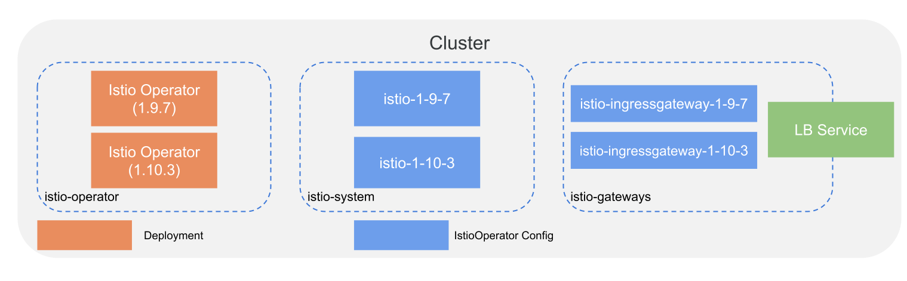
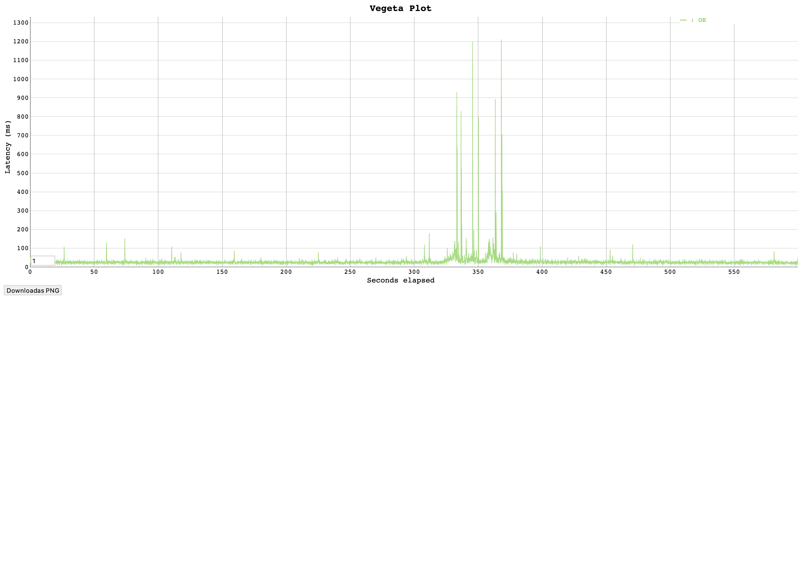

# Upgrade Istio Example



## Prep

- Download and install [direnv](https://direnv.net)
- Download and Install [pipx](https://pypa.github.io/pipx/)

```sh
brew install pipx
```

```sh
pipx install poetry
poetry config virtualenvs.in-project true
```

Install ansible and its co

```shell
poetry install
```

Activate the `virtualenv` and install Ansible dependencies:

```shell
poetry shell
ansible-galaxy collection install -r requirements.yml
```

## Deploy Istio 1.9.7

Edit the `vars.yml` and ensure that,

- `istio_versions -> 1.9.7 --> install` is set to `yes`
- `istio_versions -> 1.10.3 --> install` is set to `no`

### vars.yaml

```yaml
...
istio_versions:
  1.9.7:
    sha256: 4d4a15f14137869a5b6f7a38fde67b0ab14da9ab824ffc21025b70e407236b32
    install: yes
  1.10.3:
    sha256: cbe84864b6db358c0998c83e0c58c041d1ee81aa9dea108eaa8ebe5cc80de657
    install: no
...
```

Run the following commmand so start the install and configure,

```sh
ansible-playbook playbook.yaml
```

The ansible play will do the following,

- Download and install `minikube` and creates a Kubernetes cluster
- Install istio v1.9.7 using Istio Operator in istio-operator namespace
- Install Istio Gateways in istio-gateways namespace
- Install BookInfo App in bookinfo namesapace

## Test that productpage is reachable

```shell
INGRESS_IP=$(kubectl get svc -n istio-gateways istio-ingressgateway -ojsonpath='{.status.loadBalancer.ingress[*].ip}')
curl "http://$INGRESS_IP:8080/productpage"
```

## Generate Traffic

In a separete terminal, start generating some traffic as we upgrade istio to test that there is 0 downtime.

* install vegeta load test tool https://github.com/tsenart/vegeta
* run the 10 min load test that sends 10rps to localhost:8080/productpage: `./load/run.sh`

## Deploy Istio 1.10 Operator

Edit the `vars.yml` and ensure that,

- `istio_versions -> 1.9.7 --> install` is set to `no`
- `istio_versions -> 1.10.3 --> install` is set to `yes`

### vars.yaml

```yaml
...
istio_versions:
  1.9.7:
    sha256: 4d4a15f14137869a5b6f7a38fde67b0ab14da9ab824ffc21025b70e407236b32
    install: no
  1.10.3:
    sha256: cbe84864b6db358c0998c83e0c58c041d1ee81aa9dea108eaa8ebe5cc80de657
    install: yes
...
```

Run the following command to peform the upgrade,

```sh
ansible-playbook playbook.yaml
```

The play will,

- Install Istio v1.10.3 using Istio Operator in istio-operator namespace
- Install Istio Gateways v1.10.3 in istio-gateways namespace
- Update the istio ingress gateway service to use `1.10.3` revision
- Resatart BookInfo Applications in bookinfo namesapace

## Cleanup  up assets

We should be able to leverage the 1-9-7 operator to uninstall the old istio assets. Once that is complete we can cleanup the old operator as well.

```sh
ansible-playbook cleanup.yml
```

## Validate Traffic

Once the load traffic script is complete a graph of the requests is available to view at `open $WORK_DIR/plot.html`.

* Example Stats - The below output is the statistics of my run. It shows that we recieved 6000 `200` response codes and no error codes.

```txt
Requests      [total, rate, throughput]         6000, 10.00, 10.00
Duration      [total, attack, wait]             10m0s, 10m0s, 26.776ms
Latencies     [min, mean, 50, 90, 95, 99, max]  15.344ms, 29.06ms, 25.727ms, 33.811ms, 41.936ms, 85.286ms, 1.212s
Bytes In      [total, mean]                     29091004, 4848.50
Bytes Out     [total, mean]                     0, 0.00
Success       [ratio]                           100.00%
Status Codes  [code:count]                      200:6000  
Error Set:
```

* Example Plot - As you can see there was a spike in latency when we were migrating the applications to the new sidecar. We could fix these spikes by configuring the application scaling properties.

